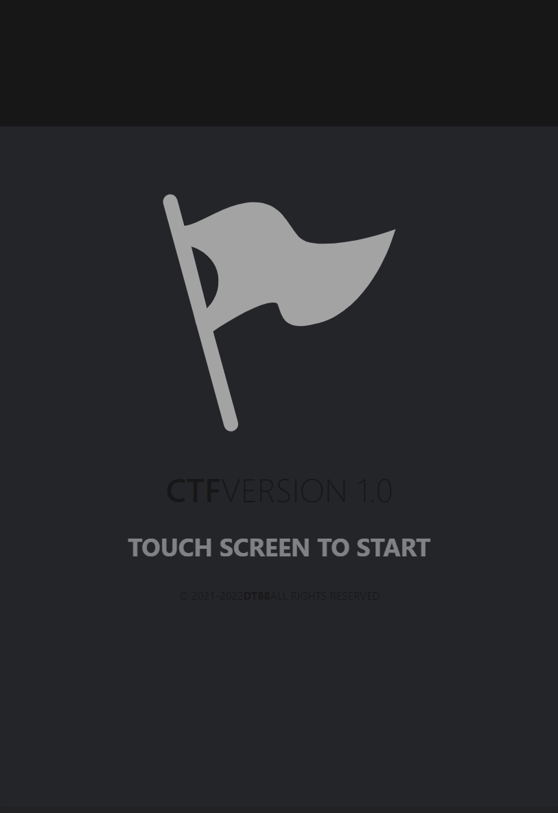
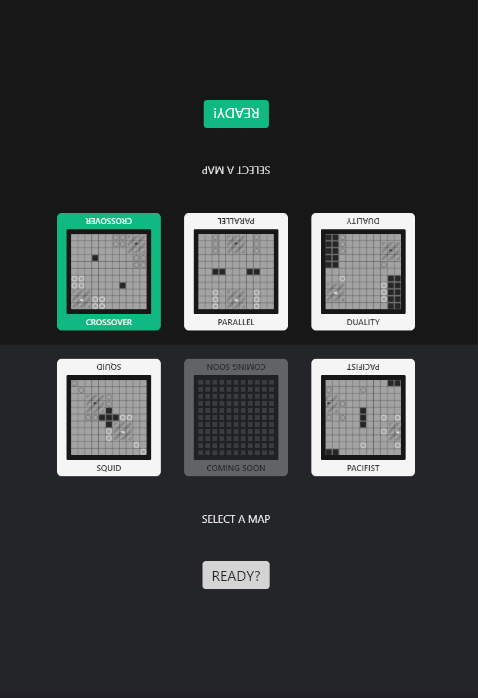
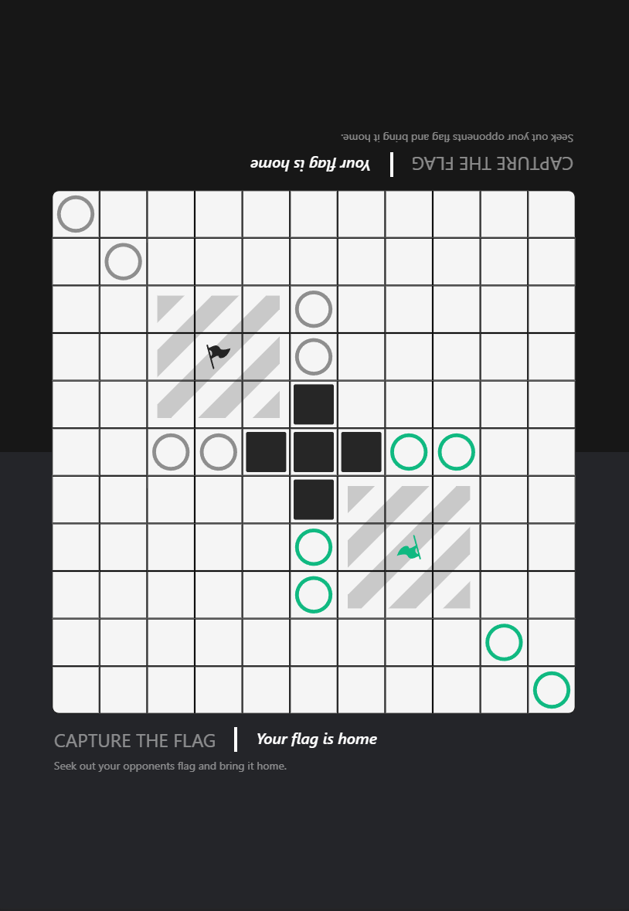

# **CTF**: Capture The Flag

**HTML, Tailwindcss & JavaScript.**  
*No packages or external tools are used in this project*   
[**Click Here to play CTF**](https://dillanthomas88.github.io/CTF/ "play now")

# About

The idea was to make a **Two-Player Couch-Coopertive game on** on iPad *Only* where players face off against eachother much like a traditional board game. 
 
 

### Code that I feel great about

This is an example of what one of the board layouts look like. I built two seperate **Classes** *( Board & Piece )*. Both of which have functions within them that take other functions as perameters. This allows me to make a **New Map Layout** in a *matter of minutes.*    Sometimes it can be a pain trying to change something for testing purposes. In **this** project, I 'll gladly say *"No problem, brb"* to the famous thought:    *- "Hey, it would be cool if the map looked like this.. and had pieces over here.."*   
Here is all the code needed to make a completly new experience.

    switch (layout) {
        case 1:
            this.setPiece(board.get('row', 1), blackStar, 9, 1, 'black-score')
            this.setPiece(board.get('col', 10), blackMarker, 4, 2)
            this.setPiece(board.get('col', 9), blackMarker, 4, 2)
            this.setPiece(board.get('row', 0), blackMarker, 7, 2)
            this.setPiece(board.get('row', 1), blackMarker, 7, 2)

            this.setPiece(board.get('row', 9), whiteStar, 1, 1, 'white-score')
            this.setPiece(board.get('col', 0), whiteMarker, 7, 2)
            this.setPiece(board.get('col', 1), whiteMarker, 7, 2)
            this.setPiece(board.get('row', 10), whiteMarker, 4, 2)
            this.setPiece(board.get('row', 9), whiteMarker, 4, 2)

            this.setWall(board.get('row', 3), 4, 1)
            this.setWall(board.get('row', 7), 8, 1)

            this.setScoreZone()
            break;

# Images
### Title Screen

---
### Map Selection

---

### Match Starting

